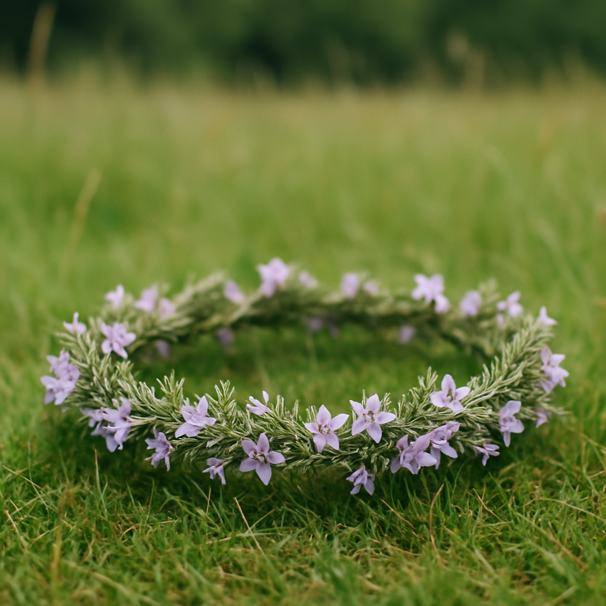
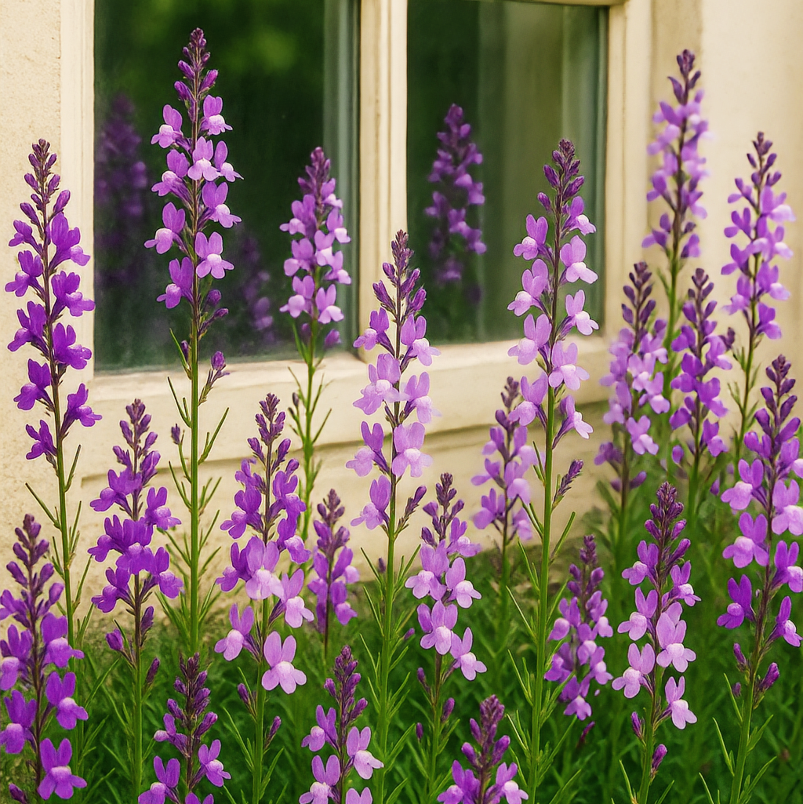
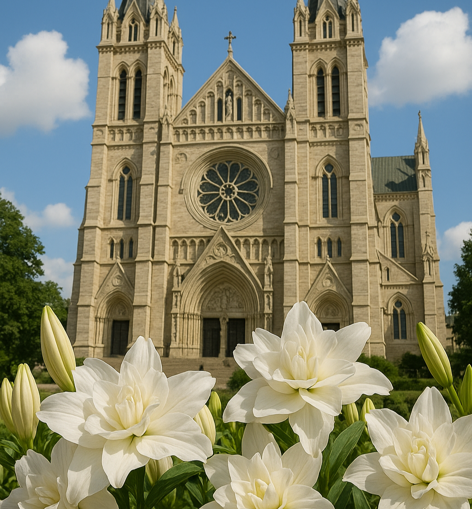

# 自作曲ピアノ楽譜「組曲　花言葉」全12曲
### Piano Solo original songs - Sheet Music 
- クラシックピアノを弾くようになり、何百年も後の人達が自分の作品を弾き継いでくれるのってなんか素敵だなあと思って細々と作っていた曲を残すことにしました。目標は百年後のピアノ発表会で子供達が定番曲として弾いてくれるピアノソナタを一曲残すことです。花の名前を付けているのは、その花を見たときに曲を思い出してくれるといいなあという思いからです。曲のイメージにあった花言葉を持つ花を選んでいます。
- ジャンル的には「現代クラシック」になるのかなと思いますが、前衛的な要素は全く無く作曲技法としては古典派（ベートーヴェン時代）もしくはロマン派（ショパン時代）で、とても保守的な曲ばかりと思います。（私は古典派が好き）POPS曲も作ってきましたがクラシックにこだわっているのは百年単位で残る普遍性があるからです。
- JASRAC未登録ですので許諾不要です。比較的初級者で弾けますが弾き映えする曲だと思いますのでピアノ発表会などで無償で自由にご利用ください。
- どれか一曲ということであれば[第5番「レインリリーの森」](https://github.com/misuz/sheetmusic?tab=readme-ov-file#pianosolono5csharpminorpdf)をお勧めします。初〜中級で弾けて、心に残る切なくて美しい曲です。腕に自信のある方は第7、9、10、12番あたりをどうぞ。
- しっくりきていない部分があるので時々書き換えます。そういう意味では私が死んだ時が最終版（完成）ということに。
- 第5番までの.sdxの拡張子は[KAWAIのスコアメーカーZERO](https://cm.kawai.jp/products/smz/)で読み込むことができます。KAWAIさんありがとうございます。第6番からの.msczの拡張子は[musescore](https://musescore.org/ja)で読み込むことができます。いずれも簡易的な自動演奏ができます。
- コードネームは適当なのでたぶんいろいろ間違っていると思います。楽譜通りに弾かなければいけないというクラシック名曲のようなこだわりはありませんので自由にアレンジしてご利用ください。
- 実際にピアノを弾きながら作曲しているので、作曲当時の私の演奏技量に応じた編曲になっています。つまり後半へ行くほど演奏の難易度は上がります。難易度の☆は私の個人的なレベル表ですので正しくないかもしれません。
- 本ページのイメージイラスト（写真）はAIで独自に生成したものです。
- pdfのリンクをクリックして楽譜の右上にある「...」からPDFファイルをダウンロードできます。コンビニ等で印刷できます。

### [PianoSoloNo1Dmajor.pdf](https://github.com/misuz/sheetmusic/blob/main/PianoSoloNo1Dmajor.pdf)
#### 第1番　ピアノ独奏曲／ニ長調 「リラの咲く湖」Piano Solo No.1/D-major/Lakeside with bloom of lilas.
- 1990年頃の作曲
- 難易度：☆☆（初級）
- 清楚で可憐で壮大なイメージ。大学生のころにピアノの良さに気づき、初めて作曲したピアノ曲。ピアノを習ったことがなくまだたいして弾けなかったので自動演奏専用機（シーケンサー）で作曲した曲です。
- 観光案内システムに組み込まれ、とある湖畔の街の役所ロビーでBGMとして流していたことがあります。
- リラはライラックの別名。ライラックの花言葉は「思い出」「友情」。北海道の花。

### [PianoSoloNo2Dmajor.pdf](https://github.com/misuz/sheetmusic/blob/main/PianoSoloNo2Dmajor.pdf)
#### 第2番　ピアノ独奏曲／ニ長調 「フクシアの耳飾り」 Piano Solo No.2/D-major/Earrings of Fuchsia.
- 2005年作曲
- 難易度：☆☆（初級）パソコンで作曲した曲です。
- あるソフトウェアのBGMとして組み込まれていました。
- フクシア（フューシャ）はフューシャピンクという色の名称にもなっている通り、鮮やかなえんじ色に近いピンクの花。
- 花の形がイヤリングに似ていることから、幼い子供達が耳飾りにして遊んだといわれています。上品で穏やかで平和な可愛らしい曲です。
- フクシアの花言葉は「つつましい愛」「上品」

### [PianoSoloNo3WaltzEmoll.pdf](https://github.com/misuz/sheetmusic/blob/main/PianoSoloNo3WaltzEmoll.pdf)
#### 第3番　ピアノ独奏曲／ホ短調　ワルツ「ラベンダーフィールドの約束」Piano Solo No.3/E-moll/A promise in the lavender field.
- 2024年作曲
- 難易度：☆☆☆（初中級）中間部がやや難しいので弾けない音は省略しても良いと思います。ピアノを習い始めてまもない頃に作曲した曲です。
- 2024年にヒットしたドラマ「涙の女王」のラストシーンのイメージで作った曲です。天国で再会した二人がラベンダーの草原で躍るワルツ。難病で生死をさまよった彼女は、どちらか先に死んだほうは残されたほうが死ぬときに必ず迎えに来てね、そうすれば死も怖くないから、という約束をしていた。悲しげですがハッピーエンドの曲です。
- 6度の和声メロディーが美しい曲です。ヴァイオリンにも向いています。ヴァイオリン・ピアノ二重奏にどうぞ。
- ラベンダーの花言葉は「あなたを待っています」
- (PC試奏動画) https://youtu.be/9nH-02WPazs
- 

### [PianoSoloNo4Passacalia.pdf](https://github.com/misuz/sheetmusic/blob/main/PianoSoloNo4Passacalia.pdf)
#### 第4番　オルガン独奏曲／パッサカリア　変ニ長調・変ロ短調「海風とネモフィラの草原」 Piano Solo No.4/D-flat-major,B-flat-minor/Nemophila grassland in the sea breeze.
- 2024年作曲
- 難易度：☆☆（初級）
- パイプオルガンが好きでパイプオルガン向きの曲を作ろうと思って作った曲。バロック調。パッサカリアはスペイン発祥の繰り返しの多い三拍子の舞踊曲で低音に主題がある曲。短い曲。
- ネモフィラの花言葉は「可憐」「あなたを許す」。

### [PianoSoloNo5Cismoll.pdf](https://github.com/misuz/sheetmusic/blob/main/PianoSoloNo5cismoll.pdf)
#### 第5番　ピアノ独奏曲／嬰ハ短調「レインリリーの森」 Piano Solo No.5/Cis-moll/Forest of Rainlily.
- 2024年作曲
- 難易度：☆☆☆（初中級・オクターブ多用、ウナコルダ（左ペダル）多用するので少し難しい）人生初の発表会で披露した曲です。
- 嬰ハ短調は短調12調の中でも最も暗い、陰鬱、悲しい響きとされこれを主調とする曲はとても少ないとのことですがベートーヴェンやショパンが好んで使っています。
- レインリリー（雨ユリ。正式名はゼフィランサス）は長い雨の後に一斉にユリに似た花を咲かせます。白い花に限りタマスダレという和名を持っています。
- レインリリーの花言葉は「プラトニックラブ」「メッセージ」。彼岸花の仲間であることから、亡くなった恋人からのメッセージ、という意味もあります。切ない響きの美しい曲です。
- この曲をテーマにした短編小説があります。[レインリリーの咲く日に](https://note.com/seewheniseeyou/n/n96d4a6aaf813?sub_rt=share_pw)
- [作曲者自身によるヘタクソな演奏をどうぞ　:Drz](https://youtu.be/EXOdnixtUEI)
- (PC試奏) https://youtu.be/l7F3D3NMYNU
- 
 

### [PianoSoloNo6Emoll.pdf](https://github.com/misuz/sheetmusic/blob/main/PianoSoloNo6Emoll.pdf)
#### 第6番　ピアノ独奏曲／ホ短調「スターチスの丘」　Piano Solo No.6/E-moll/Statice blooming on the hills.
- 2025年作曲
- 難易度：☆☆☆☆（中級）
- 短調ですがグルーブ感のあるかっこいい曲です。ゲーム音楽っぽい感じもあり（運動会のBGM？という意見も...）。
- スターチスは青や紫の小さな花をたくさんつけ、その華やかさから花束やドライフラワーの素材としてとても人気があります。とても丈夫な花で風に吹かれても散らずにいつまでも咲き続ける強さがあります。
- スターチスの花言葉は「変わらぬ心」「永久不変」「途絶えぬ記憶」「永遠の愛」
- (PC試奏動画) https://youtu.be/rSId5xeR0qE

### [PianoSoloNo7Fismoll.pdf](https://github.com/misuz/sheetmusic/blob/main/PianoSoloNo7Fismoll.pdf)
#### 第7番　ピアノ独奏曲／嬰ヘ短調「クレマチス・アーマンディの城跡（じょうせき）」　Piano Solo No.7/Fis-moll/Castle ruins with Clematis Armandii.
- 2025年作曲
- 難易度：☆☆☆☆☆（上級・きちんと弾くにはショパンのエチュード並みに難しい曲ですが初級者の方は中盤以降の変奏部分を省略して弾いても良いと思います）
- 古典派な感じのクラシックピアノ曲です。大ロンド形式の変奏曲。切ない響きの美しく激しい曲です。
- クレマチスは蔓（つる）草の女王と呼ばれ、建物を覆い尽くすように蔓を伸ばし、大きな花をたくさん咲かせます。 この曲は楽譜が美しく、蔓草に覆われた城壁のように見えることから曲名となりました。
- クレマチスの中でもアーマンディはとても細いツルから真っ白な大きくて立派な花を咲かせることから、内面の美しさ、精神の美、心の美しい人、心の中の美しい思い出、といった意味の花言葉を持っています。
- 思い出の場所は失われてしまったけれど、美しい思い出として心に残っている。第5番「レインリリーの森」は今は亡き人を偲ぶ曲ですが、この曲は「今は無き場所」を偲ぶ曲です。この曲をテーマにした短編小説があります。 [海辺の観覧車](https://note.com/seewheniseeyou/n/n60c7e0fa7025)
- (PC試奏動画) https://youtu.be/ELWz_VosXfs
- 

### [PianoSoloNo8Gdur.pdf](https://github.com/misuz/sheetmusic/blob/main/PianoSoloNo8Gdur.pdf)
#### 第8番　ピアノ独奏曲／ホ短調「ウエストリンギアの花冠（カロラ）」　Piano Solo No.8/G-dur,E-moll/A corolla of Westringia.
- 2025年作曲
- 難易度：☆☆☆（初中級）一見音数が多く見えますが左手伴奏が簡単なので初級でも弾けると思います。
- 寂しさと切なさを感じさせる穏やかで優しい曲です。クラシック感はなく現代風の曲で、ほとんどの部分がホ短調基調ですが最終的にはト長調で終わります。平行調の関係。
- ウエストリンギアはローズマリーに似ていますが、香りがまったくないことから「飾り気のない、誠実な」という意味を与えられています。れんげ草のように円形に編み込んで花冠（カロラ）を作ることができます。
- ウエストリンギアの花言葉は「真実の愛」
- (PC試奏動画) https://youtu.be/_HZNCd79A5Q
- 

### [PianoSoloNo9.pdf](https://github.com/misuz/sheetmusic/blob/main/PianoSoloNo9.pdf)
#### 第9番　ピアノ独奏曲／嬰ハ短調「リナリアが咲く時」　Piano Solo No.9/When Linaria flowers bloom.
- 2025年作曲
- 難易度：☆☆☆☆（中級）
- 今までと作風が変わってクラシック的な響きを求めて試行した習作。メロディも伴奏もとてもクラシック的な曲で、コード進行や音の響きがとても複雑。嬰ハ短調の暗い響きで始まりますが、たびたび転調し、本能のままに転調していったら最後はハ長調で終わります。
- リナリアの花言葉は「この恋に気づいて」「幻想」「乱れる乙女心」。調号が乱れ飛びダブルシャープが乱舞する混乱した楽譜ですので、曲名は心が揺れ動く「恋に落ちる時」みたいな意味合いでつけました。しかし、弾いてみると意外とノリが良く、メロディーも覚えやすいワルツです。（8分の6拍子なので厳密にはワルツではないですが）
- (PC試奏動画) https://youtu.be/71gPzkErFQI
- 

### [PianoSoloNo10.pdf](https://github.com/misuz/sheetmusic/blob/main/PianoSoloNo10.pdf)
#### 第10番　ピアノ独奏曲／ニ長調「自由の島、ピエリスの花」　Requiem for Liberty-Island the girl with Pieris flowers.
- 2025年作曲
- 難易度：☆☆☆☆（中級）ゆったりした曲ですが音のバランスを取るのが難しく、綺麗に演奏するには技術のいる曲です。
- 2025年春、[「お嬢さん」の愛称で多くの人に愛されたリバティーアイランドという名馬](https://ja.wikipedia.org/wiki/%E3%83%AA%E3%83%90%E3%83%86%E3%82%A3%E3%82%A2%E3%82%A4%E3%83%A9%E3%83%B3%E3%83%89)がいました。乗馬中の事故で大怪我を負いましたが騎手が安全に下馬するまで痛みに耐え続け、そしてその場で亡くなりました。その優しいエピソードにちなんで作った鎮魂歌です。ピエリスは「献身」「二人で旅をしましょう」という彼女（リバティーアイランド）にぴったりな素敵な花言葉を持っています。
- ピエリスは通称Japanese Andromeda、和名をアセビ（馬酔木）といい、日本固有種の花木です。薄いピンク色のスズランに似た花をつける低木であることから別名Lily-of-the-valley Bush（スズランの木）ともいいます。
- 約8分の長い曲です。途中平行調のロ短調に転調し最後は変格終止（Ⅳ→Ⅰ）いわゆる「アーメン終止」で終わります。明るい長調基調ですが深い悲しみと感謝を感じさせる曲です。
- (PC試奏動画) https://youtu.be/PF9vvrQzFEI
- 
- （ピエリスの花がAIで描けなかったのでこの花はピエリスではありません）

### [PianoSoloNo11.pdf](https://github.com/misuz/sheetmusic/blob/main/PianoSoloNo11.pdf)
#### 第11番　オルガン独奏曲／ニ短調「ローズリリーの鐘楼」Church bell of Roselily.　
- 2025年作曲
- 難易度：☆☆（初級）パイプオルガンのための讃美歌風の曲です。和声の勉強のために作った約2分の短い曲です。最後はいわゆるピカルディ終止（同主長調のI）で終わります。
- ローズリリーは八重咲の豪華なユリで、特にアイシャやルドウィナといった品種はとても美しく「威厳」「純粋」「純潔」といった意味を持ちます。聖母マリア様の象徴とされカトリック教会に縁の深い花です。
- (PC試奏動画) https://youtu.be/jtuysKmVIVM
- 

### [PianoSoloNo12.pdf](https://github.com/misuz/sheetmusic/blob/main/PianoSoloNo12.pdf)
#### 第12番　ピアノ独奏曲／ニ短調「花の記憶の抒情詩（バラード）」Ballard on memories of flowers.
- 2025年作曲
- 難易度：☆☆☆☆☆（上級）派手な曲ですが弾きやすく、見た目ほど難しくないと思います。
- 劇的な変化を伴って物語のように場面が展開していく長い曲（バラード形式）。約11分あります。
- 11番のコード進行を発展させた構成になっていますが次々と転調してゆき、最後は主調であるニ短調に戻って終わります。
- 最後の作品なので、特定の花の名前は付けませんでした。人それぞれ思い出の花があると思いますので、それを思い浮かべながら弾いて（聴いて）ほしい曲です。
- (PC試奏動画) https://youtu.be/yjGjEHqYq4A
- 

---
音楽というのは演奏の難しさを競う競技ではありません。だから、簡単に弾けて心に残る曲というのが本当の名曲なのだと思います。作曲者自身が一番気に入っている曲は第5番「レインリリーの森」です。

