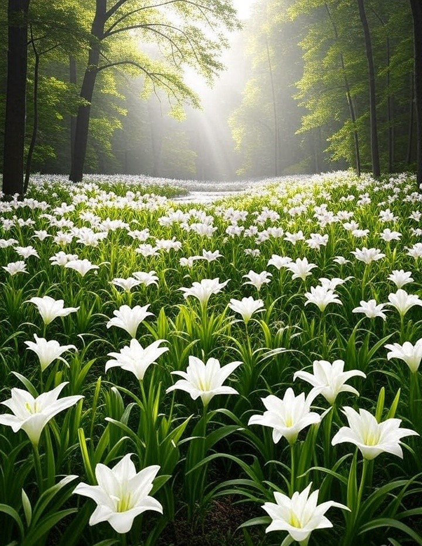

# 自作曲ピアノ楽譜 Piano Solo Sheetmusic
- クラシックピアノを弾くようになり、何百年も後の人達が自分の作品を弾き継いでくれるのってなんか素敵だなあと思って残すことにしました。目標は100年後のピアノ発表会で子供達が定番曲として弾いてくれるピアノソナタを一曲残すことです。
- ジャンル的には「現代クラシック」になるのかなと思います。花の名前を付けているのは、その花を見たときに曲を思い出してくれるといいなあという思いからです。
- しっくりきていない部分があるので時々書き換えます。そういう意味では私が死んだ時が最終版（完成）ということに。
- .sdxの拡張子は[KAWAIのスコアメーカーZERO](https://cm.kawai.jp/products/smz/)で読み込むことができます。KAWAIさんありがとうございます。
- .msczの拡張子は[musescore](https://musescore.org/ja)で読み込むことができます。
- コードネームは適当。独学なのでたぶん間違っていると思います。スコアメーカーZEROで自動的にアテられるところはアテました。
- JASRAC未登録ですので許諾不要です。比較的初級者で弾けますが弾き映えする曲だと思いますのでピアノ発表会などで無償で自由にご利用ください。
- 実際にピアノを弾きながら作曲しているので、作曲当時の私の演奏技量に応じた編曲になっています。つまり後半へ行くほど演奏の難易度は上がります。
- 本ページのイメージイラスト（写真）はAIで独自に生成したものです。

### [PianoSoloNo1Dmajor.pdf](https://github.com/misuz/sheetmusic/blob/main/PianoSoloNo1Dmajor.pdf)
ピアノ独奏曲1番／ニ長調 「リラの咲く湖」Piano Solo No.1/D-major/Lakeside with bloom of lilas.
- 1990年頃の作曲
- 難易度：☆☆（初級・ブルグミュラー程度）
- 清楚で可憐で壮大なイメージ。
- 本楽譜はピアノ独奏ですが、ストリングス、ベース、コーラス、パーカッションを入れたフルスコア版もあり、ある湖畔の町の役所ロビーのBGMとして流していたことがあります。映画音楽っぽい雰囲気の曲です。
- リラはライラックの別名。ライラックの花言葉は「思い出」「友情」。北海道に咲く花。北海道洞爺湖の湖畔に咲くライラック。

### [PianoSoloNo2Dmajor.pdf](https://github.com/misuz/sheetmusic/blob/main/PianoSoloNo2Dmajor.pdf)
ピアノ独奏曲2番／ニ長調 「フクシアの耳飾り」 Piano Solo No.2/D-major/Earrings of Fuchsia.
- 2005年作曲
- 難易度：☆☆（初級・ブルグミュラー程度）
- あるソフトウェアのBGMとして組み込まれていました。
- フクシア（フューシャ）はフューシャピンクという色の名称にもなっている通り、鮮やかなえんじ色に近いピンクの花。
- 花の形がイヤリングに似ていることから、幼い子供達が耳飾りにして遊んだといわれています。上品で穏やかで平和な可愛らしい曲です。
- フクシアの花言葉は「つつましい愛」「上品」

### [PianoSoloNo3WaltzEmoll.pdf](https://github.com/misuz/sheetmusic/blob/main/PianoSoloNo3WaltzEmoll.pdf)
ピアノ独奏曲3番／ホ短調　ワルツ「ラベンダーフィールドの約束」Piano Solo No.3/E-moll/A promise in the lavender field.
- 2024年作曲
- 難易度：☆☆☆（初中級）中間部がやや難しいので弾けない音は省略しても良いと思います。
- 2024年にヒットしたドラマ「涙の女王」のラストシーンのイメージで作った曲です。
- 天国で再会した二人がラベンダーの草原で躍るワルツ。難病で生死をさまよった彼女は、どちらか先に死んだほうは残されたほうが死ぬときに必ず迎えに来てね、そうすれば死も怖くないから、という約束をしていた。悲しげですがハッピーエンドの曲です。
- 6度の和声メロディーが美しい曲です。バイオリンにも向いています。
- ラベンダーの花言葉は「あなたを待っています」

### [PianoSoloNo4Passacalia.pdf](https://github.com/misuz/sheetmusic/blob/main/PianoSoloNo4Passacalia.pdf)
ピアノ(オルガン)独奏曲4番／パッサカリア　変ニ長調・変ロ短調「海風とネモフィラの草原」 Piano Solo No.4/D-flat-major,B-flat-minor/Nemophila grassland in the sea breeze.
- 2024年作曲
- 難易度：☆☆（初級・ブルグミュラー程度）
- パイプオルガンが好きでパイプオルガン向きの曲を作ろうと思って作った曲。バロック調。パッサカリアはスペイン発祥の繰り返しの多い三拍子の舞踊曲。短い曲。
- ネモフィラの花言葉は「可憐」「あなたを許す」。

### [PianoSoloNo5Csharpminor.pdf](https://github.com/misuz/sheetmusic/blob/main/PianoSoloNo5Csharpminor.pdf)
ピアノ独奏曲5番／嬰ハ短調「レインリリーの森」 Piano Solo No.5/C-sharp-minor/Forest of Rainlily.
- 2024年作曲
- 難易度：☆☆☆（初中級・オクターブ多用、ウナコルダ（左ペダル）多用するので少し難しい）
- 嬰ハ短調は12調の中で最も暗い、陰鬱、悲しい響きとされこれを主調とする曲はとても少ないとのことですがベートーヴェンやショパンが好んで使っています。
- レインリリー（雨ユリ）は長い雨の後に一斉にユリに似た白い花を咲かせます。（正式名：ゼフィランサス、和名：タマスダレ、彼岸花の仲間）
- レインリリーの花言葉は「けがれなき愛」。切ない響きの美しい曲です。
- この曲をテーマにした短編小説があります。[レインリリーの咲く日に](https://note.com/seewheniseeyou/n/n96d4a6aaf813?sub_rt=share_pw)
- [作曲者自身によるヘタクソな演奏をどうぞ（笑）:Drz](https://www.facebook.com/share/v/1EwM61WNy8/) 初期の草稿アレンジなので楽譜と少し違います。
- [高音質版（ヘタなのは変わらない）](https://www.facebook.com/share/v/1HYjNF98Uk/) こちらは楽譜どおりに弾いています。

 

### [PianoSoloNo6Emoll.pdf](https://github.com/misuz/sheetmusic)（採譜準備中のため楽譜未公開、試奏動画のみ）
ピアノ独奏曲6番／ホ短調「スターチスの丘」　Piano Solo No.6/E-moll/Statice blooming on the hills.
- 2025年作曲
- 難易度：☆☆☆☆（中級）
- 楽譜は修正中なので暫定版です（DAWから出したまま）
- 短調ですがグルーブ感のあるかっこいい曲です。ゲーム音楽っぽい感じもあり（運動会のBGMという意見もあり）。
- スターチスは青や紫の小さな花をたくさんつけ、その華やかさから花束やドライフラワーの素材としてとても人気があります。とても丈夫な花で風に吹かれても散らずにいつまでも咲き続ける強さがあります。
- スターチスの花言葉は「変わらぬ心」「永久不変」「途絶えぬ記憶」「永遠の愛」
- (PC試奏動画) https://youtu.be/rSId5xeR0qE

### [PianoSoloNo7Fismoll.pdf](https://github.com/misuz/sheetmusic/blob/main/PianoSoloNo7Fismoll.pdf)
ピアノ独奏曲7番／嬰ヘ短調「クレマチス・アーマンディの城跡（じょうせき）」　Piano Solo No.7/Fis-moll/Castle ruins with Clematis Armandii.
- 2025年作曲
- 難易度：☆☆☆☆☆（上級・本来はかなり速弾きの曲ですがゆっくり弾いても良いです）
- 古典派な感じのクラシックピアノ曲です。大ロンド形式の変奏曲。
- クレマチス・アーマンディは「つる草の女王」と言われ壁などを覆うように大輪の可憐な白い花をたくさん咲かせます。楽譜を見るとつる草のように見えることから曲名にしました。切ない響きの美しく激しい曲です。
- クレマチス・アーマンディの花言葉は「精神の美、心の美しさ」
- この曲をテーマにした短編小説があります。[クレマチス・アーマンディの記憶](https://note.com/seewheniseeyou/n/n89201a9525d0?sub_rt=share_pb)
- (PC試奏動画)※初期の草稿段階のものを入力したので簡易版です。実際（楽譜）よりアレンジがシンプルになっています。 https://youtu.be/gAcEBxImGkU 

### [PianoSoloNo8Gdur.pdf](https://github.com/misuz/sheetmusic/blob/main/PianoSoloNo8Gdur.pdf)
ピアノ独奏曲8番／ト長調「ウエストリンギアの花冠」　Piano Solo No.8/G-dur/A corolla of Westringia.
- 2025年作曲
- 難易度：☆☆（初級）一見音数が多く見えますが左手伴奏が簡単なので初級でも弾けると思います。ほんのり寂しさを感じさせる穏やかで優しい曲です。
- ウエストリンギアはローズマリーに似ていますが、香りがまったくないことから「飾り気のない、誠実な」という意味を与えられています。れんげ草のように円形に編み込んで花冠（カロラ）を作ることができます。
- ウエストリンギアの花言葉は「真実の愛」

### おまけ（たまにはこういう曲も作ります）
- 某アイドルグループに提供した楽曲のDEMO音源
- アイドルの子が作詞した詞に合わせて作った曲ですので（非公開ですが）歌詞があります。
- (PC試奏動画) https://youtu.be/Pf7Eg3K7PcA
